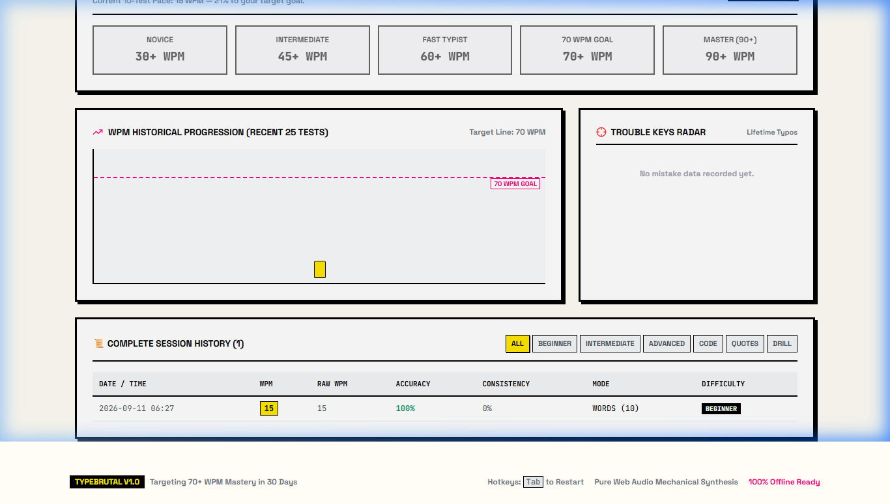
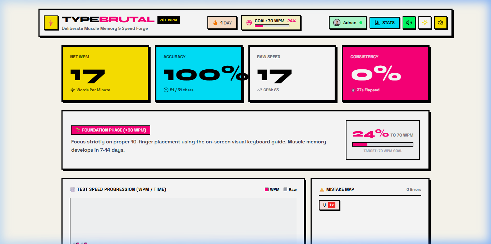
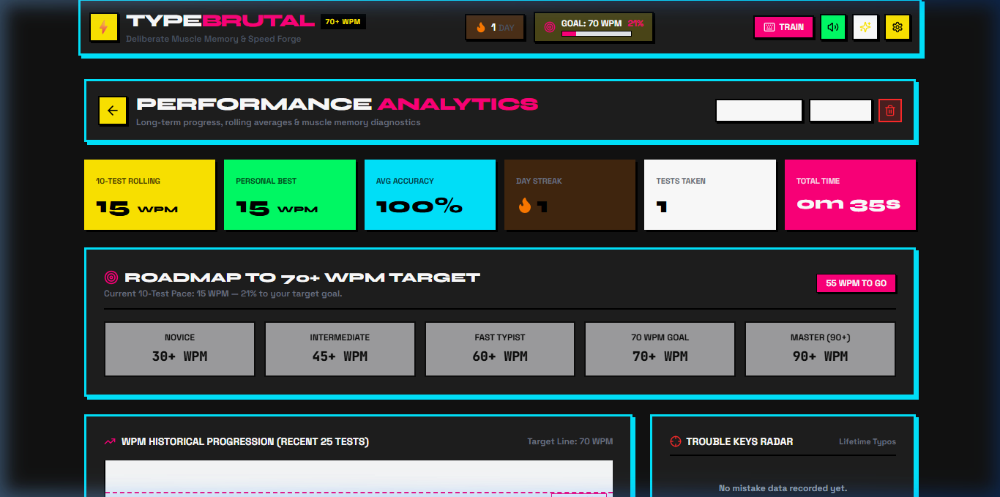

# TYPEBRUTAL ⚡
### 70+ WPM Muscle Memory & Typing Speed Accelerator

<p align="center">
  <a href="https://typebrutal.adnanahmad.tech" target="_blank">
    
  </a>
  <a href="https://adnanahmad.tech" target="_blank">
    
  </a>
  <a href="https://www.linkedin.com/in/adnanrahmad" target="_blank">
    
  </a>
</p>

<p align="center">
  
  
  
  
  
  
  
</p>

---

## ⚡ Overview

**TYPEBRUTAL** is a high-performance, deliberate-practice typing acceleration platform engineered to break typists out of the common 50–60 WPM speed plateau and push them past 70–100+ WPM.

Built with a bold **Neobrutalist design philosophy**, TYPEBRUTAL rejects generic minimalist typing interfaces in favor of raw tactile feedback, sub-millisecond input responsiveness, real-time error frequency heatmaps, procedural ngram drills, multi-switch acoustic synthesis, and seamless cross-device cloud persistence with Google Firebase.

<p align="center">
  
</p>

---

## 📸 Interface & Feature Showcase

| 🎯 Real-Time Training Engine | 📊 Advanced Performance Analytics |
|:---:|:---:|
|  |  |
| **Instant WPM, 10-Finger ANSI Virtual Keyboard, & Live Heatmap** | **WPM Trajectory, Error Breakdown & Rolling Averages** |

| 📈 Test Completion Diagnostics | 🕶️ Cyber Brutal (Dark Mode) |
|:---:|:---:|
|  |  |
| **Net WPM, Raw WPM, Accuracy, Consistency, & Mistake Retests** | **High-contrast, low-eyestrain theme with custom carets** |

---

## 🌟 Key Features

### 1. ⌨️ Exact-Scale ANSI Virtual Keyboard (10-Finger System)
- **10-Finger Touch Typing Zones**: Each key is color-coded to its anatomical touch-typing finger zone with dedicated **Left Hand** and **Right Hand** color legends.
- **Physical Key Mirroring**: Real-time keystroke visual feedback and dynamic next-character target pulsing (`Space`, `Shift`, punctuation, and alphabetic characters).
- **Mutually Exclusive Heatmap Mode**: Instant toggle to dynamic mistake frequency view (🔴 `>60%`, 🟠 `30–60%`, 🟡 `<30%`, ⚪ Clean).
- **Click-Lock Ergonomics**: Virtual keyboard is locked against unintended mouse clicks while maintaining complete reactive state to physical keystrokes.

### 2. 🎯 Deliberate Practice & Dynamic Ngram Synthesis
- **Curated Word Banks**: Standard top 200/1000 English words, programmatic English sentences, JavaScript/TypeScript code snippets, and alphanumeric punctuation modes.
- **Targeted Mistake Remediation**: Tracks individual character error frequencies in real-time and procedurally generates targeted drills focusing on problematic keys.
- **Multi-Mode Modifiers**:
  - **Timed Modes**: 15s, 30s, 60s, 120s sprint challenges.
  - **Word Targets**: 10, 25, 50, 100 word bursts.
  - **Blind Mode**: Hides live stats during the test to eliminate performance anxiety.
  - **Confidence Mode**: Disables backspace corrections to train forward momentum.

### 3. 🔊 Pure Web Audio Switch Sound Engine
- Zero external audio sample downloads or network latency.
- Mathematically synthesized mechanical switch profiles using the browser's native `AudioContext` and dynamic oscillators:
  - **Cherry MX Blue** (Crisp high-frequency click with tactile rebound)
  - **Cherry MX Brown** (Subtle mid-frequency bottom-out bump)
  - **Cherry MX Red** (Smooth linear clack)
  - **Vintage Typewriter** (Metallic mechanical hammer strike)
  - **Cyber Synth** (8-bit arcade sine wave feedback)

### 4. ☁️ Real-time Firebase Cloud Sync & Google Auth
- **One-Click Google Authentication**: Sign in securely to persist typing metrics across devices.
- **Firebase Realtime Database**: Automatic conflict-free background synchronization for settings, test history, mistake logs, and daily streak counters.
- **Offline Resilient**: Local storage fallback ensures complete functionality and instant data availability even without an active internet connection.
- **Self-Service Account Privacy**: Complete one-click account deletion that purges user data from Firebase Auth and Realtime Database.

### 5. 📊 Deep Statistical Telemetry
- **Standard WPM** (`(characters / 5) / minutes`) & **Raw WPM** (including uncorrected errors).
- **Accuracy Percentage** & **Key Consistency** (standard deviation across keystroke timestamps).
- **Rolling Performance Metrics**: Rolling averages across the last 5, 10, and 25 tests with visual benchmark indicators for the **70 WPM Master Typist goal**.
- **Data Portability**: Full JSON export and import capabilities for local backup and data sovereignty.

---

## 🛠️ Architecture & Tech Stack

```
typing-practice/
├── src/
│   ├── components/            # Neobrutalist UI Components
│   │   ├── AnalyticsView.tsx  # Chart.js graphs, error matrix & history table
│   │   ├── FirebaseModal.tsx  # Google Auth & Realtime Database sync modal
│   │   ├── Footer.tsx         # Developer credentials & portfolio links
│   │   ├── Header.tsx         # Live speed indicator, streak & navigation
│   │   ├── SettingsModal.tsx  # Audio engine, themes, carets & word filters
│   │   ├── StatsDashboard.tsx # Post-test diagnostics & mistake drills
│   │   ├── TypingCanvas.tsx   # Sub-millisecond keystroke capture engine
│   │   └── VirtualKeyboard.tsx# ANSI layout, 10-finger guide & heatmap
│   ├── data/
│   │   └── wordLists.ts       # English lemmas, code drills & punctuation text
│   ├── services/
│   │   ├── firebaseService.ts # Realtime Database & Google Auth integration
│   │   ├── soundEngine.ts     # Web Audio API oscillator synthesis
│   │   └── storageService.ts  # LocalStorage persistence & migration schema
│   ├── types/
│   │   └── index.ts           # Central TypeScript definitions
│   ├── App.tsx                # Master state controller & session orchestrator
│   └── main.tsx               # React 19 root bootstrap
├── public/                    # Static assets & screenshots
├── index.html                 # OpenGraph metadata & Google Fonts
└── tailwind.config.js         # Neobrutalist design tokens & hard shadows
```

| Technology | Purpose |
| :--- | :--- |
| **React 19** | Component-driven reactive UI architecture |
| **TypeScript 5.7** | End-to-end static type safety & robust state definitions |
| **Vite 6** | Instant HMR development server and optimized rollup bundling |
| **TailwindCSS 3.4** | Utility-first styling with custom Neobrutalist theme tokens |
| **Firebase 11** | Google Identity authentication & Realtime Database cloud storage |
| **Lucide React** | Lightweight, high-contrast SVG iconography |
| **Web Audio API** | Zero-latency algorithmic switch acoustic generation |

---

## 🚀 Getting Started

### Prerequisites
- **Node.js**: `v18.0.0` or higher
- **npm** or **yarn** / **pnpm**

### Installation

1. **Clone the repository:**
   ```bash
   git clone https://github.com/adnanaskh/typebrutal.git
   cd typebrutal
   ```

2. **Install dependencies:**
   ```bash
   npm install
   ```

3. **Configure Environment Variables:**
   Create a `.env` file in the root directory (or copy from `.env.example`):
   ```env
   VITE_FIREBASE_API_KEY=your_firebase_api_key
   VITE_FIREBASE_AUTH_DOMAIN=your_project.firebaseapp.com
   VITE_FIREBASE_PROJECT_ID=your_project_id
   VITE_FIREBASE_STORAGE_BUCKET=your_project.firebasestorage.app
   VITE_FIREBASE_MESSAGING_SENDER_ID=your_sender_id
   VITE_FIREBASE_APP_ID=your_app_id
   VITE_FIREBASE_MEASUREMENT_ID=your_measurement_id
   VITE_FIREBASE_DATABASE_URL=https://your_project-default-rtdb.firebaseio.com
   ```

4. **Start the local development server:**
   ```bash
   npm run dev
   ```
   Open [http://localhost:5173](http://localhost:5173) in your browser.

5. **Build for Production:**
   ```bash
   npm run build
   ```

---

## 🎨 Design System: Neobrutalism

TYPEBRUTAL utilizes a purposeful, high-energy **Neobrutalism** aesthetic characterized by:
- **Bold 3px/4px Solid Black Borders** (`border-black`)
- **Hard, Non-Blurred Drop Shadows** (`box-shadow: 4px 4px 0px #000`)
- **High-Saturation Pop Colors** (Yellow `#FFE600`, Pink `#FF007A`, Cyan `#00F0FF`, Lime `#00FF66`, Orange `#FF6B00`)
- **Monospace & Industrial Typography** (`Space Mono`, `Syne`, `Outfit`)
- **Micro-Interactions**: Tactile `active:translate-x-0.5 active:translate-y-0.5` click responses simulating physical hardware.

---

## 👨‍💻 Developer & Author

**Adnan Ahmad**
- 🌐 **Portfolio Website**: [adnanahmad.tech](https://adnanahmad.tech)
- 💼 **LinkedIn**: [linkedin.com/in/adnanrahmad](https://www.linkedin.com/in/adnanrahmad)
- 🐙 **GitHub**: [github.com/adnanaskh](https://github.com/adnanaskh)
- ⚡ **Live Application**: [typebrutal.adnanahmad.tech](https://typebrutal.adnanahmad.tech)

---

## 📄 License

This project is open source and available under the [MIT License](LICENSE).
